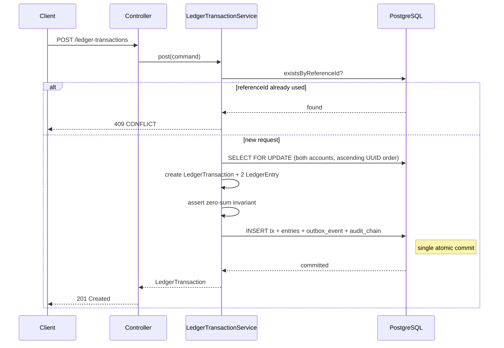

# AetherLedger — Project Walkthrough

> A complete technical overview for engineers, recruiters, and interviewers.
> Reading time: ~15 minutes.

---

## Table of Contents

1. [Project overview](#1-project-overview)
2. [Why this project exists](#2-why-this-project-exists)
3. [What problem it solves](#3-what-problem-it-solves)
4. [Why it is stronger than a CRUD app](#4-why-it-is-stronger-than-a-crud-app)
5. [Main architecture](#5-main-architecture)
6. [Core flows](#6-core-flows)
7. [Security and production-readiness](#7-security-and-production-readiness)
8. [Testing strategy](#8-testing-strategy)
9. [How to run locally](#9-how-to-run-locally)
10. [How to explain this in interviews](#10-how-to-explain-this-in-interviews)
11. [Future improvements](#11-future-improvements)

---

## 1. Project overview

**AetherLedger** is a production-grade **double-entry financial ledger and reconciliation API**
built with Java 17 and Spring Boot 3.

It implements the core backend infrastructure that underpins payment systems, neobanks, and
marketplace platforms: a tamper-evident record of every monetary movement, a reconciliation
engine that verifies internal state against external payment providers, and an event-driven
notification layer for downstream consumers.

The project is intentionally designed to demonstrate the engineering decisions that separate
production financial systems from tutorial-grade applications — concurrency control, idempotency,
append-only history, cryptographic audit trails, and operational observability — not as abstract
concepts, but as working, tested code.

**Current state:**
- 16 domain features implemented end-to-end
- 293 integration tests, all passing, against a real PostgreSQL instance
- Full CI pipeline (GitHub Actions) with secret scanning (Gitleaks) and CVE scanning (Trivy)
- Swagger UI available at `/swagger-ui.html`

---

## 2. Why this project exists

Every company that handles money eventually builds a ledger. Payment processors, neobanks,
marketplaces, embedded finance platforms — all of them reach a point where the core question
is: *where is the money, who owns it, and can we prove it?*

Off-the-shelf general-purpose databases answer none of these questions on their own. You need:

- **Correctness guarantees** — money must be conserved; no amount can appear or disappear
- **Immutable history** — corrections must be new records, not edits to old ones
- **Reconciliation** — your internal view must be verifiable against the external world
- **Operational observability** — you need to detect data corruption before a customer does

AetherLedger is a ground-up implementation of these primitives. The design reflects patterns
found in production ledger systems at companies like Stripe, Brex, and Shopify Pay.

---

## 3. What problem it solves

### The core problem: tracking money correctly under concurrency

Money cannot be in two places at once, must never be created or destroyed, and every movement
must be traceable to a specific event at a specific point in time.

These constraints are easy to state and hard to implement correctly when:

- Multiple requests arrive simultaneously for the same account
- A client retries a failed request (was it actually processed or not?)
- An external payment provider disagrees with your internal record
- A database administrator makes a "quick fix" to a historical record
- A background job runs concurrently with user-facing writes

AetherLedger addresses each of these:

| Problem | Solution |
|---|---|
| Concurrent writes on same account | Pessimistic `SELECT … FOR UPDATE` with deadlock-safe lock ordering |
| Duplicate/retried requests | Two-layer idempotency: pre-flight check + DB UNIQUE constraint |
| Balance inconsistency | Balance is never stored — derived from entry sums at read time |
| External/internal mismatch | Reconciliation engine with per-item and aggregate health reports |
| Historical record tampering | SHA-256 hash chain across all significant events |
| Silent data corruption | Live integrity checks + immutable point-in-time snapshots |
| Missing event delivery | Transactional outbox — event write is atomic with business operation |

---

## 4. Why it is stronger than a CRUD app

A CRUD app stores, retrieves, updates, and deletes records. AetherLedger does none of the
last two, and the first two carry correctness guarantees that a generic CRUD layer cannot provide.

### Append-only history

Ledger entries and reconciliation records are write-once. All JPA column mappings carry
`updatable = false`. There are no `UPDATE` code paths for financial records.

Corrections are modelled as new records: a reversal transaction creates two new entries that
net the original to zero. The original is never touched. This is not a technical limitation
— it is a deliberate design choice that makes the audit trail tamper-evident by construction.

### Derived balances

Account balances are computed by summing all ledger entries at read time. There is no balance
column. This eliminates an entire class of bugs where a stored balance diverges from the entry
history — a common failure mode in systems that maintain both.

### Multi-layer correctness enforcement

The zero-sum invariant (every transaction's entries must sum to zero) is enforced at three
independent layers:

1. **Application layer** — `assertDoubleEntryInvariant()` runs before any INSERT
2. **Database layer** — a `CHECK (amount <> 0)` constraint on `ledger_entries`
3. **Ops layer** — `GET /api/v1/ops/integrity/ledger` counts violations across the entire ledger

No single bug or bypass defeats all three simultaneously.

### Two-phase transaction lifecycle

Transactions can be posted immediately (intent and settlement in one atomic operation) or via
a two-phase flow where the intent is recorded as `PENDING` and settled externally before the
ledger entries are written. This models how card authorisations and ACH batch payments work.

### Cryptographic audit trail

A SHA-256 hash chain records every significant event. Modifying a historical record directly
in the database breaks the chain at that sequence number — detectable with a single API call.

---

## 5. Main architecture

### High-level structure

```
┌─────────────────────────────────────────────────────────────┐
│                     HTTP / REST layer                        │
│   Controllers · DTOs · GlobalExceptionHandler · Swagger UI  │
└────────────────────────────┬────────────────────────────────┘
                             │
┌────────────────────────────▼────────────────────────────────┐
│                      Service layer                           │
│  LedgerTransactionService · ReconciliationService · Ops     │
│  HoldService · AuditChainService · OutboxService            │
│  WebhookDeliveryService · ScheduledReconciliationService    │
└────────────────────────────┬────────────────────────────────┘
                             │
┌────────────────────────────▼────────────────────────────────┐
│               Spring Data JPA / Hibernate                   │
│          Pessimistic locks · @Version optimistic locks      │
└────────────────────────────┬────────────────────────────────┘
                             │
┌────────────────────────────▼────────────────────────────────┐
│                   PostgreSQL 16                              │
│  Schema owned by Flyway · NUMERIC(19,4) · TIMESTAMPTZ       │
│  UUID PKs · Explicit FK names · CHECK constraints           │
└─────────────────────────────────────────────────────────────┘
```

### Package structure

```
com.aetherledger/
├── api/               Controllers, DTOs, GlobalExceptionHandler, Interceptors
├── config/            @ConfigurationProperties, WebMvcConfig, OpenApiConfig
├── domain/
│   ├── entity/        JPA entities (Account, LedgerTransaction, LedgerEntry, …)
│   └── enums/         AccountType, TransactionStatus, HoldStatus, …
├── exception/         Typed domain exceptions (all extend LedgerException)
├── repository/        Spring Data repositories with custom JPQL and native queries
└── service/           Business logic, background jobs, command objects
```

### Technology choices

| Concern | Choice | Reason |
|---|---|---|
| Language | Java 17 | LTS, records, pattern matching, strong Spring support |
| Framework | Spring Boot 3.5 | Production-grade autoconfiguration, well-understood in fintech |
| ORM | Spring Data JPA + Hibernate | Pessimistic lock support, cascading, `@Version` |
| Schema | Flyway | Schema is source-controlled; `ddl-auto=validate` only |
| Database | PostgreSQL 16 | NUMERIC precision, TIMESTAMPTZ, partial indexes, advisory locks |
| API docs | springdoc-openapi | Auto-generated Swagger UI from annotations |
| Testing | JUnit 5 + Testcontainers | Real database, real schema — no H2 approximations |

---

## 6. Core flows

### 6.1 Create an account

```
POST /api/v1/accounts
  Body: { "name": "Alice Wallet", "type": "USER" }

  1. Validate: name must not be blank, type must be USER / SYSTEM / MERCHANT
  2. Persist Account — the DB UNIQUE constraint on (name) is the final guard
  3. Return 201 with account UUID and createdAt
```

**Balance:** no balance column is ever written. `GET /api/v1/accounts/{id}/balance` returns
`{ currentBalance, heldBalance, availableBalance }` — all computed from entry sums at query time.

---

### 6.2 Post a ledger transaction (immediate)

```
POST /api/v1/ledger-transactions
  Body: { debitAccountId, creditAccountId, amount, referenceId }

  1. Validate inputs (non-null, amount > 0, debit ≠ credit)
  2. Pre-flight referenceId check — 409 if already exists
  3. Lock both accounts with SELECT … FOR UPDATE in ascending UUID order
       → eliminates the AB/BA deadlock when two requests touch the same pair in opposite order
  4. Create LedgerTransaction (status = SUCCESS)
  5. Create LedgerEntry: debit  (amount = -amount, on debitAccount)
     Create LedgerEntry: credit (amount = +amount, on creditAccount)
  6. Assert zero-sum invariant in application code before any write
  7. Persist atomically — entries cascade from transaction
  8. Catch DataIntegrityViolationException on referenceId UNIQUE → 409
  9. Write OutboxEvent + ledger_audit_chain entry in same transaction
  10. Return 201 with transactionId
```

**Two-phase variant:**
`POST /ledger-transactions/pending` creates the transaction with `status = PENDING`
and no entries. `POST /{id}/complete` writes the entries and transitions to SUCCESS.
`POST /{id}/fail` transitions to FAILED with no entries written.



---

### 6.3 Reverse a transaction

```
POST /api/v1/ledger-transactions/{id}/reversal
  Body: { "referenceId": "REV-PAY-001" }

  1. Lock original transaction with SELECT … FOR UPDATE
  2. Guard: status must be SUCCESS, reversedByTransactionId must be null
       → a transaction can only be reversed once (UNIQUE constraint on reversedByTransactionId)
  3. Fetch original ledger entries to identify debit and credit accounts
  4. Lock both accounts in ascending UUID order
  5. Create reversal LedgerTransaction (reversalOfTransactionId = original.id)
  6. Flip accounts: credit the original debitor, debit the original creditor
  7. Write two new entries; assert zero-sum
  8. Set original.reversedByTransactionId = reversal.id
  9. Persist both transactions atomically
  10. Write OutboxEvent + audit chain entry
  11. Return 201 with reversal transactionId
```

The original transaction is **never mutated**. Linkage is bidirectional and immutable.

---

### 6.4 Reconcile a single transaction

```
POST /api/v1/ledger-transactions/{id}/reconcile
  Body: { "externalReferenceId": "EXT-001", "externalStatus": "SUCCESS" }

  1. Load transaction
  2. Set externalReferenceId, externalStatus, reconciledAt on the transaction
  3. Compute reconciliationResult:
       MATCHED                    — internal SUCCESS ↔ external SUCCESS
       STATUS_MISMATCH            — internal and external disagree
       MISSING_EXTERNAL_REFERENCE — externalReferenceId not provided
  4. Persist + write OutboxEvent + audit chain entry
  5. Return 200 with updated transaction

GET /api/v1/ops/integrity/reconciliation
  → { totalTransactions, matchedCount, mismatchCount,
      notReconciledCount, missingExternalReferenceCount, healthy }
  healthy = false when mismatch > 0 or missingRef > 0
```

---

### 6.5 Batch and scheduled reconciliation

**Batch (operator-driven):**
```
POST /api/v1/reconciliation/batch
  Body: { "items": [ { referenceId, externalReferenceId, externalStatus }, … ] }
  Up to 500 items per call.

  For each item:
    1. Look up transaction by referenceId
    2. Apply externalStatus, compute reconciliationResult
    3. Write one ReconciliationRunItem (immutable)
  Write one ReconciliationRun with aggregate counts (immutable)
  Return run summary + per-item results
```

**Scheduled (background):**
```
ScheduledReconciliationJob fires every 30 s (configurable, disabled in tests)
  → Pulls unreconciled transactions
  → Calls ExternalReconciliationClient (FakeExternalReconciliationClient in dev;
    swap for a real HTTP client in production)
  → Applies results via ReconciliationService
```

Every run is persisted as an **immutable audit record**. Operators can retrieve the exact state
of any past reconciliation via `GET /api/v1/reconciliation/runs/{id}`.

---

### 6.6 Webhook delivery, retry, and DLQ

```
1. Business operation (e.g. post transaction) completes
       └─► OutboxService.publish()   ← same DB transaction, never lost

2. outbox_events row written (published = false)

3. OutboxRelayJob fires every 30 s (disabled in tests)
       └─► For each unpublished outbox event:
             → Find active WebhookSubscriptions matching event_type
             → HTTP POST to each targetUrl with event payload
             → Write WebhookDelivery row (SUCCESS or FAILED + error detail)
             → Mark outbox event published

4. WebhookRetryJob fires every 60 s (disabled in tests)
       └─► Retries FAILED deliveries with attempt tracking
             → After max attempts: status = DEAD  (dead-letter queue)

5. POST /api/v1/webhook-deliveries/{id}/retry
       → Manual re-trigger for an individual delivery (ops endpoint)
```

**Why transactional outbox?** If the event were published after committing the ledger
transaction, a crash between the two would lose the event permanently. Writing the outbox row
in the same transaction as the business operation makes them atomic: either both commit or
neither does.

**Supported event types:**
`TRANSACTION_POSTED`, `TRANSACTION_COMPLETED`, `TRANSACTION_REVERSED`,
`TRANSACTION_RECONCILED`, `HOLD_CREATED`, `HOLD_CAPTURED`, `HOLD_RELEASED`,
`BATCH_RECONCILIATION_COMPLETED`

---

### 6.7 Audit chain verification

```
Every significant ledger event appends one row to ledger_audit_chain:

  payloadHash = SHA-256(deterministic event payload string)
  currentHash = SHA-256(
      sequenceNumber | eventType | entityType |
      entityId | payloadHash | previousHash
  )
  previousHash of entry N = currentHash of entry N-1
  (null for the genesis entry)

Sequence numbers are assigned under a PostgreSQL advisory lock so
concurrent transactions cannot claim the same position.
```

**Verification endpoint:**
```
POST /api/v1/ops/ledger-integrity/chain/verify
  (requires X-Internal-Api-Key header)

  Reads all entries in sequence order.
  For each entry:
    1. Recompute currentHash from stored fields
    2. Verify it matches the stored currentHash
    3. Verify previousHash matches the preceding entry's currentHash

  Response:
  {
    "valid": true | false,
    "checkedRecords": 1248,
    "brokenAtSequenceNumber": null | 58,
    "brokenAtId": null | "uuid",
    "message": "Ledger audit chain is intact: 1248 entries verified"
  }
```

**Tamper scenario:** a database administrator directly updates `event_type` on row 58.
The next call to `/verify` returns `valid: false, brokenAtSequenceNumber: 58` — the recomputed
hash no longer matches the stored hash.

Supporting endpoints:
- `GET /api/v1/ops/ledger-integrity/chain/latest` — chain tip
- `GET /api/v1/ops/ledger-integrity/chain/events/{entityId}` — all events for a domain entity
- `GET /api/v1/ops/ledger-integrity/chain` — paginated listing

---

## 7. Security and production-readiness

### Secrets and configuration

All sensitive values are injected via environment variables. No credentials, API keys,
or tokens appear anywhere in the committed codebase.

| Value | Environment variable | Default |
|---|---|---|
| Database URL | `DB_URL` | `jdbc:postgresql://localhost:5432/aetherledger` |
| Database username | `DB_USERNAME` | `postgres` |
| Database password | `DB_PASSWORD` | *(blank — must be set)* |
| Internal ops key | `INTERNAL_API_KEY` | *(blank — fail-closed)* |
| AI insights key | `AI_INSIGHTS_API_KEY` | *(blank — AI disabled)* |

`.env` is listed in `.gitignore`. `.env.example` is committed with placeholder values.

### Internal ops API key

All endpoints under `/api/v1/ops/**` require an `X-Internal-Api-Key` header:

```bash
curl -H "X-Internal-Api-Key: $INTERNAL_API_KEY" \
  http://localhost:8080/api/v1/ops/ledger-integrity/chain/verify
```

Implementation details:
- `InternalApiKeyInterceptor` (Spring `HandlerInterceptor`) registered only for `/api/v1/ops/**`
- Comparison uses `MessageDigest.isEqual` — constant-time to prevent timing side-channels
- **Fail-closed:** if `INTERNAL_API_KEY` is blank, every ops request returns `401 UNAUTHORIZED`
- Public endpoints, Swagger UI, and `/actuator/health` are unaffected

### Security CI pipeline

`.github/workflows/security.yml` runs on every push and pull request:

| Job | Tool | What it checks |
|---|---|---|
| `secret-scan` | Gitleaks | Full git history scanned for committed secrets (`fetch-depth: 0`) |
| `vulnerability-scan` | Trivy | Filesystem + dependency CVE scan, HIGH/CRITICAL only, `--ignore-unfixed` |

Results appear directly in CI logs. Gitleaks configuration in `.gitleaks.toml` allowlists the
test-only key in `application-test.properties` (a known, non-production value).

### Schema safety

- Flyway owns all DDL — the app never auto-generates schema (`ddl-auto=validate`)
- `NUMERIC(19,4)` for all monetary amounts — exact decimal, no floating-point error
- `TIMESTAMPTZ` for all timestamps — stored in UTC
- All FK constraints and indexes are named explicitly in migrations

---

## 8. Testing strategy

### Philosophy

**293 integration tests. Zero mocks of infrastructure.**

Every test runs against a real PostgreSQL 16 instance provisioned by Testcontainers. Flyway
applies every production migration before any test executes. The schema tests see is
byte-for-byte identical to the schema production sees.

### Why not H2 or mocks?

H2 does not enforce `NUMERIC(19,4)` precision, does not support `TIMESTAMPTZ` semantics,
does not enforce `CHECK` constraints by default, and does not behave identically to PostgreSQL
under concurrent writes. A test suite that passes on H2 can fail in production for reasons
that are impossible to catch without a real database.

### Test structure

```
AbstractIntegrationTest (shared base)
  ├── Static PostgreSQLContainer — started once per JVM, shared across all test classes
  ├── @DynamicPropertySource — injects live container URL into Spring context
  └── resetDatabase() — 12 DELETE statements in FK-safe order, called from every @BeforeEach

Test classes (20 total):
  AccountControllerTest           HoldControllerTest
  LedgerTransactionControllerTest IdempotencyIntegrationTest
  ReconciliationControllerTest    OutboxEventTest
  AuditChainControllerTest        OutboxRelayTest / OutboxRelayRetryTest
  OpsControllerTest               WebhookDeliveryIntegrationTest
  InternalApiKeyInterceptorTest   WebhookRetryIntegrationTest
  AuditTimelineControllerTest     WebhookSubscriptionControllerTest
  ReconciliationInsightControllerTest   MetricsIntegrationTest
  ScheduledReconciliationServiceTest    ConcurrentModificationTest
  AiInsightGeneratorTest (unit test — no Spring context)
```

### What the tests cover

| Scenario | How tested |
|---|---|
| Zero-sum invariant | Directly seeded corrupt entries; integrity endpoint detects violation |
| Idempotency race condition | Two-layer guard verified (pre-flight + constraint) |
| Deadlock prevention | Concurrent threads posting against same account pair |
| Optimistic locking | Concurrent reconcile on same transaction — one wins, one gets 409 |
| Hold concurrency | 4 threads simultaneously try to capture the same hold — exactly 1 wins |
| Outbox relay | Relay called directly; published/failed counts asserted |
| Webhook retry + DLQ | Failed deliveries exhausted to DEAD status |
| Audit chain tamper | `jdbcTemplate.update()` mutates a row; `/verify` returns `valid: false` |
| Interceptor — ops key | No key → 401, wrong key → 401, correct key → request proceeds |
| Reconciliation batch | 500-item batch; immutable run + items asserted |
| Scheduled reconciliation | Service called directly; timing is deterministic |

### Test profile

`application-test.properties` disables all background jobs so tests control timing exactly:
```properties
aetherledger.reconciliation.scheduled.enabled=false
outbox.relay.enabled=false
webhooks.retry.scheduled.enabled=false
internal.api-key=test-internal-api-key
```

---

## 9. How to run locally

### Prerequisites

- Java 17+
- Maven 3.8+
- Docker (for Testcontainers or Docker Compose)

### Option A — Docker Compose (recommended)

```bash
# Copy and configure credentials
cp .env.example .env
# Edit .env: set DB_PASSWORD and INTERNAL_API_KEY

docker compose up --build
```

App: `http://localhost:8080`  
Swagger UI: `http://localhost:8080/swagger-ui.html`  
Health: `http://localhost:8080/actuator/health`

### Option B — Maven with local PostgreSQL

```bash
export DB_URL=jdbc:postgresql://localhost:5432/aetherledger
export DB_USERNAME=postgres
export DB_PASSWORD=yourpassword
export INTERNAL_API_KEY=dev-key

mvn spring-boot:run
```

### Run the test suite

```bash
# Docker must be running (Testcontainers starts its own PostgreSQL)
mvn test --no-transfer-progress
```

Expected output:
```
Tests run: 293, Failures: 0, Errors: 0, Skipped: 0
BUILD SUCCESS
```

### Try the ops endpoints

```bash
# Requires X-Internal-Api-Key
curl -H "X-Internal-Api-Key: dev-key" \
  http://localhost:8080/api/v1/ops/ledger-integrity/chain/latest

# Verify the audit chain
curl -X POST -H "X-Internal-Api-Key: dev-key" \
  http://localhost:8080/api/v1/ops/ledger-integrity/chain/verify

# Ledger integrity report
curl -H "X-Internal-Api-Key: dev-key" \
  http://localhost:8080/api/v1/ops/integrity/ledger
```

---

## 10. How to explain this in interviews

### "What is this project and why did you build it?"

> AetherLedger is a financial ledger API — the kind of system that sits at the core of every
> payment company. I built it to demonstrate the backend engineering patterns that come up in
> fintech interviews and production fintech work: double-entry accounting, idempotency,
> concurrency control, reconciliation, and audit trails. It's not a tutorial project — it's
> implementing the hard parts from scratch, the way they'd actually be done in production.

### "Walk me through the most interesting engineering problem."

> The deadlock prevention in concurrent transaction posting. When two requests both want to move
> money between accounts A and B — one doing A→B, the other doing B→A — and each holds a lock
> on its first account while waiting for the other, you get a classic circular-wait deadlock.
> I solve it by always acquiring pessimistic write locks in ascending UUID order. Both requests
> will try to lock the same account first, so one waits while the other completes. Same amount
> of serialisation, zero deadlock risk. This is a standard technique but implementing it
> correctly matters — getting the sort order wrong defeats the entire purpose.

### "Why is the balance not a stored column?"

> Because two sources of truth inevitably diverge. If I store a balance and separately store the
> entries that produced it, there's always a path — a bug, a failed write, a database fix — where
> they get out of sync. Then you have a balance that doesn't match the history, and no way to know
> which one is correct. By deriving the balance from the entry sum at read time, there is exactly
> one source of truth. The entries are immutable, so the balance is always consistent with the
> history by construction. This is the approach taken by production ledgers at Stripe and similar
> companies.

### "How does idempotency work here?"

> Two layers. First, a pre-flight `existsByReferenceId` check — this handles 99% of duplicates
> cheaply. Second, if two identical requests race through that check at exactly the same moment,
> the database UNIQUE constraint on `reference_id` catches the duplicate at INSERT time. I catch
> the resulting `DataIntegrityViolationException` and translate it to a 409. The race window
> between the application-level check and the INSERT is closed by the database constraint —
> application-level locking alone isn't sufficient.

### "What is the transactional outbox pattern?"

> If I delivered a webhook event after committing the ledger transaction, a crash between the
> commit and the delivery would lose the event permanently — the ledger moved, but nobody was
> told. The outbox pattern writes the event row in the same database transaction as the business
> operation. They share a commit boundary: if the business operation rolls back, the event row
> rolls back with it; if it commits, the event row is guaranteed to exist. A background job then
> delivers events from the outbox table. At-least-once delivery from a reliable outbox is
> achievable; exactly-once end-to-end is a much harder problem.

### "Why Testcontainers instead of H2?"

> H2 doesn't behave like PostgreSQL. It doesn't enforce `NUMERIC(19,4)` precision correctly, it
> doesn't have the same locking semantics, it doesn't support partial indexes, and its `CHECK`
> constraint handling differs. A test that passes on H2 can fail in production on PostgreSQL for
> reasons that are simply impossible to catch otherwise. Testcontainers spins up a real PostgreSQL
> instance for the test run. It's slower to start than H2 but I start it once per JVM invocation
> and share it across all 293 tests, so the overhead is a one-time cost. The confidence it buys
> is worth it.

### "What does the audit chain actually prove?"

> It proves that no historical record was modified after it was written. Every event appends a
> row whose hash covers the previous row's hash plus the current event's fields. If you modify
> any row directly in the database — change an amount, alter an event type — the hash chain
> breaks at that point. The `/verify` endpoint re-derives every hash from stored data and reports
> the exact sequence number where the chain is broken. It's not a blockchain — it's a
> tamper-evident log. The threat model is an insider or a DBA making unauthorized direct database
> modifications, which is a real concern in regulated financial environments.

---

## 11. Future improvements

These are the natural next steps, in rough priority order:

| Area | What | Why |
|---|---|---|
| **Authentication** | JWT or API-key auth for all non-ops endpoints | The internal key pattern demonstrates the approach; extending it to all callers is straightforward |
| **Real webhook client** | Replace `LoggingWebhookClient` with `RestClient` + HMAC-SHA256 signing | Delivery is currently simulated; production needs real HTTP + signature verification |
| **Multi-currency** | ISO 4217 currency codes on entries; FX rate ledger | Any cross-border payment use case requires this |
| **Cursor pagination** | Keyset pagination for `GET /ledger-transactions` | Offset pagination degrades as the table grows; a cursor-based approach is stable |
| **AI reconciliation insights** | Implement `AiInsightGenerator.tryAiGenerate()` | The stub, fallback, and configuration are already wired; only the provider call is missing |
| **Read replica routing** | Route `@Transactional(readOnly=true)` queries to a replica | Integrity reports and balance reads are expensive at scale; a replica handles them without affecting write throughput |
| **Prometheus dashboard** | Wire existing Micrometer metrics to Grafana | Counters for every significant operation already exist; visualisation is the missing piece |
| **Archive partitioning** | Partition `ledger_entries` by month | Entries are immutable and grow without bound; cold partitions can move to cheaper storage |
